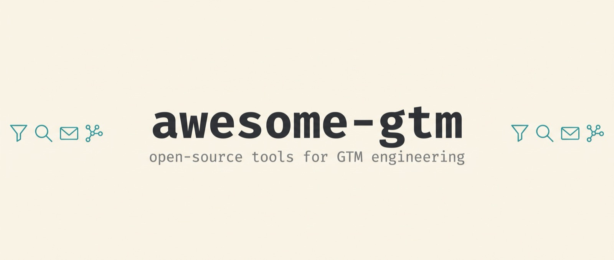

# awesome-gtm 

> A curated list of open-source tools and building blocks for GTM engineering: prospecting, enrichment, SEO, research agents and outreach.

Every repository below existed, was not archived and had a push in 2026 when checked on 2026-10-08. Licenses vary, read them before you build on a tool. Hosted data APIs are listed separately at the end.

## Contents

- [Open-source Clay and Apollo alternatives](#open-source-clay-and-apollo-alternatives)
- [Outreach, SDR agents and CRM](#outreach-sdr-agents-and-crm)
- [Enrichment and email finding](#enrichment-and-email-finding)
- [Web scraping and crawling](#web-scraping-and-crawling)
- [SEO and SERP tooling](#seo-and-serp-tooling)
- [Deep research agents](#deep-research-agents)
- [MCP servers for GTM data](#mcp-servers-for-gtm-data)
- [Agent skills and Claude Code plugins](#agent-skills-and-claude-code-plugins)
- [n8n, LangChain and workflow integrations](#n8n-langchain-and-workflow-integrations)
- [Benchmarks and datasets](#benchmarks-and-datasets)
- [Related lists](#related-lists)
- [Data APIs](#data-apis)
- [Contributing](#contributing)
- [License](#license)

## Open-source Clay and Apollo alternatives

Self-hostable tables, lead finders and enrichment engines. Check each license before you build on it; a few are AGPL or GPL.

- [bricks](https://github.com/BraaMohammed/bricks) - Local Clay alternative combining AI agents, web scraping and browser automation.
- [cubex](https://github.com/gurmohitghuman/cubex) - Self-hosted spreadsheet whose columns fill from AI prompts, API calls and webhooks.
- [dataforge](https://github.com/Nuclear-Marmalade/dataforge) - Business data enrichment engine positioned as an open-source Apollo, ZoomInfo and Clearbit alternative.
- [looot-local-leads](https://github.com/loootai/looot-local-leads) - Next.js and Supabase app for agencies that lists local businesses from Google Maps, scores their website gaps and finds a verified public email. Data through looot (pay per call).
- [looot-tables](https://github.com/loootai/looot-tables) - Clay-style enrichment tables on Supabase that call looot for the data.
- [looot-watchlist](https://github.com/loootai/looot-watchlist) - Next.js and Supabase account watchlist that turns news, matching job posts and pricing or careers page changes into a signal feed. Data through looot (pay per call).
- [openbower](https://github.com/obris-dev/openbower) - Self-hostable Clay alternative with agentic workflows that turn raw signals into researched rows.
- [OpenGTM](https://github.com/debpalash/OpenGTM) - Self-hosted Clay alternative for lead sourcing, enrichment waterfalls, buying signals and outbound.
- [opengtm](https://github.com/buildingopen/opengtm) - Open-source alternative to Clay, Apollo and Semrush with lead generation, ICP scoring and outreach automation.
- [OpenOutreach](https://github.com/eracle/OpenOutreach) - AI agent for B2B lead generation that finds fitting people and explains why each fits (GPL-3.0).
- [OpenProspector](https://github.com/clawnify/OpenProspector) - Finds and enriches B2B leads on your own provider keys, billed at cost.
- [OpenTable](https://github.com/clawnify/OpenTable) - Open-source table UI framework for building Clay-style data tables.
- [reacher-x](https://github.com/VecterAI/reacher-x) - Apollo and Clay alternative that finds prospects and reaches out (AGPL-3.0).
- [verdict](https://github.com/omm9846/verdict) - Cold-outreach engine that verifies every mailbox before sending, with email discovery.
- [YALC-the-GTM-operating-system](https://github.com/Othmane-Khadri/YALC-the-GTM-operating-system) - CLI-first, self-hosted Clay alternative that runs inside Claude Code.

## Outreach, SDR agents and CRM

Sending, replying and tracking, once you have the list.

- [b2b-sdr-agent-template](https://github.com/iPythoning/b2b-sdr-agent-template) - AI SDR template for B2B export with a 10-stage pipeline and multi-channel messaging.
- [harvey](https://github.com/ethanplusai/harvey) - Autonomous sales agent on Claude Code that finds prospects, writes cold emails and handles replies.
- [looot-lead-gen-agent](https://github.com/loootai/looot-lead-gen-agent) - Template agent that takes company domains, finds people by title, verifies emails and writes a CSV. Dry run by default.
- [twenty](https://github.com/twentyhq/twenty) - Open-source CRM positioned as an alternative to Salesforce.
- [warmbly](https://github.com/warmbly/warmbly) - Open-source B2B cold outreach and email warmup service.

## Enrichment and email finding

Code you can run yourself. Closed SaaS is out of scope here; see Data APIs for hosted providers.

- [check-if-email-exists](https://github.com/reacherhq/check-if-email-exists) - Checks whether an address exists without sending mail. Rust, with an HTTP backend.
- [discolike-cli](https://github.com/LeadGrowGTM/discolike-cli) - CLI for the DiscoLike company discovery API, with lookalike search, market sizing and enrichment. Needs a DiscoLike key.
- [google-maps-scraper](https://github.com/omkarcloud/google-maps-scraper) - Google Maps scraper that pulls 50+ data points including emails, phones and social profiles.
- [google-maps-scraper-kit](https://github.com/Mahanaicoach/google-maps-scraper-kit) - Google Maps lead scraper driven by Claude Code, exports CSV with phones, emails and websites.
- [headwater](https://github.com/HouseofLoops/headwater) - Self-hosted API for Google Maps, News, Trends and Autocomplete with normalised JSON.
- [JobSpy](https://github.com/speedyapply/JobSpy) - Job scraper for LinkedIn, Indeed, Glassdoor and ZipRecruiter, useful as a hiring signal.
- [looot-csv-enrich](https://github.com/loootai/looot-csv-enrich) - CLI that adds company, work email, email check, phone and title columns to a CSV through looot. Prints a quote first, runs inside a budget, reruns never pay twice.
- [mailchecker](https://github.com/FGRibreau/mailchecker) - Cross-language detection of disposable and throwaway email domains.
- [Scout](https://github.com/kiryano/Scout) - Scrapes Instagram, Twitch, TikTok and LinkedIn profiles, extracts emails from bios and verifies them over SMTP.
- [validate-emails](https://github.com/centminmod/validate-emails) - Self-hosted script that cleans invalid addresses from a list, with several commercial verifier backends.

## Web scraping and crawling

Turn pages into data an agent can read.

- [AnyCrawl](https://github.com/any4ai/AnyCrawl) - Node.js crawler that outputs LLM-ready data and structured Google SERP results.
- [crawl4ai](https://github.com/unclecode/crawl4ai) - Open-source crawler that outputs clean Markdown for LLMs and agents.
- [firecrawl](https://github.com/firecrawl/firecrawl) - Web data API that turns sites into clean Markdown or structured data (AGPL-3.0).
- [Scrapling](https://github.com/D4Vinci/Scrapling) - Adaptive Python scraping framework, from one request to a full crawl.

## SEO and SERP tooling

Rank tracking, audits, keyword research and self-hosted SERP access.

- [bisibility](https://github.com/CorgiCorner/bisibility) - Open-source SEO platform for Google rank tracking, keyword research and backlinks (AGPL-3.0).
- [crawlseo](https://github.com/crawlseo/crawlseo) - SEO monitoring dashboard combining Search Console, a site crawler and Core Web Vitals.
- [FreeCrawl-SEO-Tool](https://github.com/kemalai/FreeCrawl-SEO-Tool) - Site crawler for SEO audits that targets 1M+ URLs on one machine.
- [jev-seo](https://github.com/AkashPriyadarshii/jev-seo) - Rust SEO and GEO toolkit with site audits, crawls, AI citation checks and rank drift.
- [looot-seo-monitor](https://github.com/loootai/looot-seo-monitor) - Checks Google rankings for a keyword list through looot and writes a Markdown report. Python, dry run by default.
- [open-seo](https://github.com/every-app/open-seo) - Open-source alternative to Semrush and Ahrefs.
- [openserp](https://github.com/karust/openserp) - Self-hosted SERP API over browser-rendered Google, Bing, Yandex, Baidu and DuckDuckGo.
- [searchmirror](https://github.com/databluedev/searchmirror) - Self-hosted rank tracker and AI-visibility monitor, bring your own SERP key (AGPL-3.0).
- [searchstack-aeo](https://github.com/alexpospekhov/searchstack-aeo) - Open-source stack to monitor visibility across Google and AI answer engines.

## Deep research agents

Agents that plan searches, read sources and write cited reports. Useful for account research.

- [deep-research](https://github.com/u14app/deep-research) - Deep research with any LLM, exposed as an SSE API and an MCP server.
- [deep-research-web-ui](https://github.com/AnotiaWang/deep-research-web-ui) - Self-hosted web UI for a deep-research agent that outputs cited reports.
- [deep-researcher-agent](https://github.com/NVIDIA-AI-Blueprints/deep-researcher-agent) - NVIDIA reference blueprint for building a deep research agent.
- [deep-searcher](https://github.com/zilliztech/deep-searcher) - Deep research over private data, written in Python.
- [gpt-researcher](https://github.com/assafelovic/gpt-researcher) - Autonomous research agent that works with any LLM provider.
- [hyperresearch](https://github.com/jordan-gibbs/hyperresearch) - Turns Claude Code or Codex into a deep research agent that collects and synthesizes web sources.
- [last30days-skill](https://github.com/mvanhorn/last30days-skill) - Agent skill that researches a topic across Reddit, X, YouTube, Hacker News and the web, then writes a summary.
- [local-deep-research](https://github.com/LearningCircuit/local-deep-research) - Deep research that runs on local or cloud LLMs and 10+ search engines.

## MCP servers for GTM data

Give an MCP client prospecting, SEO or web data.

- [dataseo-mcp](https://github.com/egebese/dataseo-mcp) - SEO research MCP server for backlinks, keywords and traffic.
- [firecrawl-mcp-server](https://github.com/firecrawl/firecrawl-mcp-server) - Official Firecrawl MCP server for scraping and search.
- [leadmagic-mcp](https://github.com/LeadMagic/leadmagic-mcp) - Local TypeScript MCP server for the LeadMagic API: email finder, validation and company enrichment.
- [linkedapi-mcp](https://github.com/Linked-API/linkedapi-mcp) - MCP server that lets an assistant read data from and act on a LinkedIn account.
- [linkedin-mcp-server](https://github.com/stickerdaniel/linkedin-mcp-server) - MCP server for LinkedIn profiles, companies and jobs.
- [looot-mcp](https://github.com/loootai/looot-mcp) - Install steps and registry entry for the looot remote MCP server (one token, 2,500+ data endpoints).
- [open-seo-mcp-skills](https://github.com/Ryze-AI-Adgent/open-seo-mcp-skills) - SEO MCP server plus open SEO and GEO skills for Claude: keyword research, rank tracking and audits.
- [semrush-ai-tool](https://github.com/springvoiceswell/semrush-ai-tool) - MCP server and CLI for Semrush keyword, domain and backlink data. Needs a Semrush account.

## Agent skills and Claude Code plugins

Skills and plugins that teach an agent a GTM workflow.

- [google-maps-agent-skills](https://github.com/gmapsscraper/google-maps-agent-skills) - Skills for Google Maps lead generation: scrape businesses, extract emails, analyze competitors.
- [goose-skills](https://github.com/gooseworks-ai/goose-skills) - Library of growth and GTM skills plus data APIs for Claude Code, Codex and Cursor.
- [gtm-cheat-codes](https://github.com/zapier/gtm-cheat-codes) - Field guide and installable skills for go-to-market teams using coding agents.
- [gtm-cofounder](https://github.com/AIDevGTM/gtm-cofounder) - Agent skills for go-to-market work on developer tools and AI products.
- [gtm-eng-skills](https://github.com/getaero-io/gtm-eng-skills) - Ten skills for waterfall email enrichment, TAM building, signal discovery and job-change detection.
- [gtm-skills](https://github.com/loootai/gtm-skills) - 15 GTM workflow skills (account brief, lookalike list, job-change and hiring signals, list hygiene) with looot job ids and a price per step.
- [gtm-system](https://github.com/LaGrowthMachine/gtm-system) - Claude skills and an MCP server for sales teams, built around La Growth Machine campaigns.
- [influencer-discovery](https://github.com/tigerless-labs/influencer-discovery) - Claude Code skill for influencer discovery and contact enrichment across 15 channels.
- [linkedin-skills](https://github.com/Linked-API/linkedin-skills) - LinkedIn automation skills for agents: social selling and data extraction.
- [looot-skills](https://github.com/loootai/looot-skills) - Agent skills for 20 looot data jobs plus a base skill. Install with npx skills add.
- [marketingskills](https://github.com/coreyhaines31/marketingskills) - Marketing skills for Claude Code and agents: CRO, copywriting, SEO, analytics.
- [oneshot-gtm](https://github.com/oneshot-agent/oneshot-gtm) - GTM agent for technical founders with a terminal CLI and a local web dashboard.
- [seo-skills](https://github.com/seranking/seo-skills) - Claude skills for the SE Ranking MCP server: content briefs, audits, AI search share of voice.

## n8n, LangChain and workflow integrations

Wire data providers into automation you already run.

- [awesome-n8n-templates](https://github.com/enescingoz/awesome-n8n-templates) - 280+ free n8n workflow templates.
- [langchain-looot](https://github.com/loootai/langchain-looot) - LangChain tools for looot: search the catalog, inspect a price, run, check balance.
- [looot-action](https://github.com/loootai/looot-action) - GitHub Action that runs one looot operation and returns the result as JSON.
- [looot-js](https://github.com/loootai/looot-js) - Typed TypeScript client for the looot REST API with no runtime dependencies.
- [looot-n8n-workflows](https://github.com/loootai/looot-n8n-workflows) - Four importable n8n workflows on core nodes only (work email with verification, company research, signup ICP score, Google rank check), one looot credential.
- [n8n](https://github.com/n8n-io/n8n) - Fair-code workflow automation platform with AI features, self-hostable.
- [n8n-nodes-looot](https://github.com/loootai/n8n-nodes-looot) - n8n community node for looot: search, inspect, run, get run, balance.

## Benchmarks and datasets

Numbers for choosing between providers.

- [company-enrichment](https://github.com/openbenchmarks-labs/company-enrichment) - Company enrichment benchmark.
- [people-search-api-benchmark-public](https://github.com/CompanyEnrich/people-search-api-benchmark-public) - Reproducible benchmark of B2B people-search APIs on finding current CEOs and founders.

## Related lists

Other curated lists worth reading.

- [awesome-ai-lead-generation](https://github.com/toofast1/awesome-ai-lead-generation) - AI tools for finding customers, social listening and outreach.
- [Awesome-Deep-Research](https://github.com/DavidZWZ/Awesome-Deep-Research) - Papers and resources on agentic deep research.
- [awesome-lead-generation](https://github.com/dariubs/awesome-lead-generation) - Tools, strategies and resources for generating and converting leads.
- [awesome-mcp-servers](https://github.com/punkpeye/awesome-mcp-servers) - Large collection of MCP servers.
- [awesome-seo-tools](https://github.com/serpapi/awesome-seo-tools) - Curated list of SEO tools.

## Data APIs

Hosted providers with official docs. Most need an account and an API key. looot is one entry here among several; the others are direct providers you can call without it.

- [Apollo API](https://docs.apollo.io) - People and company search and enrichment from the Apollo database.
- [DataForSEO](https://docs.dataforseo.com/v3/) - SERP, keyword, backlink and on-page APIs, pay as you go.
- [Exa](https://docs.exa.ai) - Search API built for AI agents, with content retrieval.
- [Firecrawl](https://docs.firecrawl.dev) - Hosted scrape, crawl and search API that returns Markdown or JSON.
- [Hunter](https://hunter.io/api-documentation) - Domain search, email finder and email verifier APIs.
- [looot](https://docs.looot.ai) - One token and one prepaid balance for 2,500+ endpoints from 90+ providers, price shown before each run, failed calls free.
- [People Data Labs](https://docs.peopledatalabs.com) - Person and company enrichment and search APIs.
- [Serper](https://serper.dev) - Google SERP API with JSON results.
- [Tavily](https://docs.tavily.com) - Search and extract API for agents.

## Contributing

See [contributing.md](contributing.md).

## License

The list text is released under the [MIT License](LICENSE). Each linked project keeps its own license.
